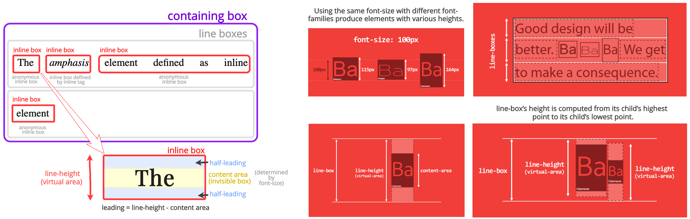
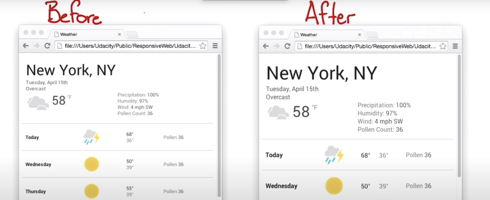
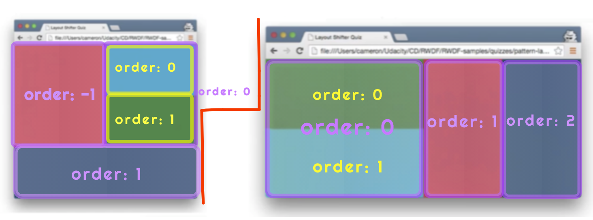
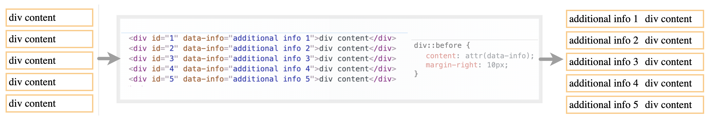
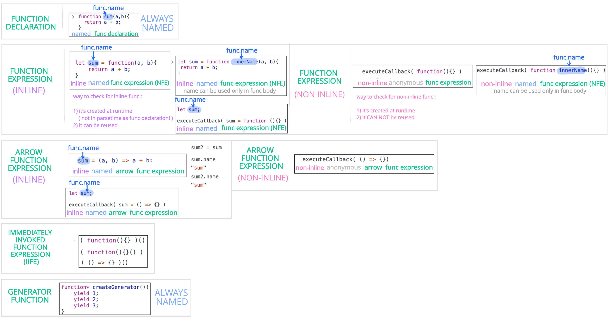
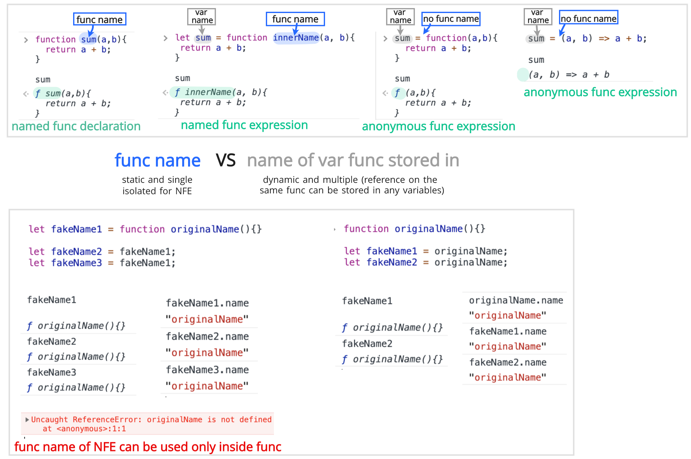
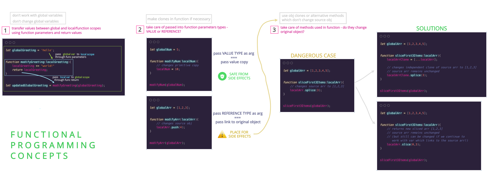
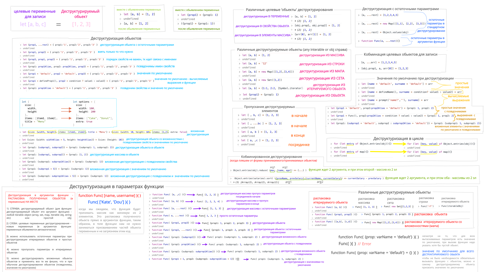

# kottans-frontend

## Repository dedicated to participation in [Kottans frontend course](https://github.com/kottans/frontend)

## My progress :rocket:

 1. **GENERAL**
    - [x] [Git and Github](#1-git-and-github)
    - [x] [Linux CLI and Networking](#2-linux-cli-and-networking)
    - [x] [VCS (hello gitty), GitHub and Collaboration](#3-vcs-hello-gitty-github-and-collaboration)
  
 2. **FRONT-END BASICS**
  
    - [x] [Intro to HTML & CSS](#4-intro-to-html--css)
    - [x] [Responsive Web Design](#5-responsive-web-design)
    - [x] [HTML & CSS Practice](#6-html--css-practice)
    - [x] [JavaScript Basics](#7-javascript-basics)
    - [ ] [Document Object Model - practice](#8-document-object-model-practice)
  
 3. **ADVANCED TOPICS**

    - [ ] [Building a Tiny JS World (pre-OOP) - practice](#9-building-a-tiny-js-world-pre-oop-practice)
    - [ ] [Object oriented JS - practice](#10-object-oriented-js-practice)
    - [ ] [OOP exercise - practice](#11-oop-exercise-practice)
    - [ ] [Offline Web Applications](#12-offline-web-applications)
    - [ ] [Memory pair game — real project!](#13-memory-pair-game-real-project)
    - [ ] [Website Performance Optimization](#14-website-performance-optimization)
    - [ ] [Friends App - real project!](#15-friends-app-real-project)
  

## GENERAL

### 1. Git and GitHub

***

#### 1.1. Course [Version Control with Git](https://www.udacity.com/course/version-control-with-git--ud123)

During this course i:

- Used just learned commands while trying to add 'after-commit' changes to the last commit of this review.
- Realized that 'versions' is not only about highly specialized software such as git and version control to varying degree can be found in almost every program.
- Worked with versions of a document (called revisions) in google docs.
- Repeated and clarified the basic concepts of git (working directory, index, repository areas and their workflow). Got acquainted with the contents of the hidden `.git` folder. Learned how to add files into `.gitignore` manually and with using special symbols.
- Updated git version and checked config info.
- Discovered new terminal commands:
  | Command | Usage |
  | --- | --- |
  | `rmdir` | remove directory |
  | `ls -a` | list hidden files |
  | `mkdir -p parent/child` | create nested directories with single command |
- Repeated and used next git commands:
  | Command | Usage |
  | --- | --- |
  | `git log`, `git show` | inspecting commits |
  | `git rm --cached <filename>` | unstaging files |
  | `git diff` | difference between working directory and last commit |
- Installed and first used [HTML linter](https://htmlhint.com/), [CSS linter](https://stylelint.io/), [JS linter](https://eslint.org/). While googling discovered command `npm init -y` for generating empty npm project.
- Worked with git documentation to find neccessary command options.
- Got acquainted with Less command line pager and it's commands for navigating through the history of commits:
  | Key | Usage |
  | --- | --- |
  | `j` or `↓` | scroll :arrow_down: by a line |
  | `d` | scroll :arrow_down: by a half-page |
  | `f` | scroll :arrow_down: by a page |
  | `k` or `↑` | scroll :arrow_up: by a line |
  | `u` | scroll :arrow_up: by a half-page |
  | `b` | scroll :arrow_up: by a page |
- Learned and used commands for commits investigation:
  | Command | Usage |
  | --- | --- |
  | `git log --oneline`, `git log --stat`, `git log --patch/-p`, `git log --stat -patch` | display all commits i  certain form |
  | `git log --oneline <commit-ref>`, `git log --stat <commit-ref>`, `git log -p <commit-ref>` | display commit  from the point where specific commit placed |
  | `git show <commit-ref>`, `git show --stat <commit-ref>`, `git show --stat --patch <commit-ref>` | ge  specific commit |
- Realized that each commit should make a change to just **ONE** aspect of the project. **Single-unit change** principle.

  > Work on one change first, commit that, and then change the second one.  
  >  
  > The best way that I've found to think about what should be in a commit is to think, "What if all chang  introduced in this commit were erased?". If a commit were erased, it should only remove one thing.
- Learned about commit naming:
  | Do :white_check_mark: | Don't :x: |
  |----|----|
  | make it *short* | don't use *and* |
  | response *what* was done | don't tell *how* and *why* it was done |
  
  > The best way that I've found to come up with a commit message is to finish this phrase, "This commit will...". However, you finish that phrase, use that as your commit message.
- Learned about entities used for organizing commits structure:
  | Entity | Description |
  | --- | --- |
  | tags  | static commit pointers  |
  | branches | dynamic commit pointers |
  | `HEAD` | dynamic branch/commit pointer |
- Practiced in creating and deleting tags/branches and switching between branches. Practiced in linking tags and branches with specific commits. Practiced working with multiple feature branches.
- Learned useful commands for work with branches:
  | Command | Usage |
  | --- | --- |
  | `git checkout -b <new-branch-name>` | create branch and switch to it |
  | `git checkout -b <new-branch-name> <existing-branch-name>` | create branch pointing on another  branch's las  commit and switch to it |
  | `git checkout -b <new-branch-name> <SHA>` | create branch pointing on specific commit and  switch to it |
  | `git log --oneline/--patch/--stat --all --graph` | log commits for all branches using graph |
- Executed fast-forward and regular merges using `git merge <other-branch>` command. If we merge 2 branches commits will be added to the one which under `HEAD` pointer (current branch). `Branch we merge into === current branch`.
  > When we merge, we're merging *some other branch* ***into the current (checked-out) branch***.
  >
  > Fast-forward merge – the branch being 'merged in' must be ahead of the current branch. Current branch'    pointer will just be moved forward to point to the same commit as the other branch.
  >
  > Regular merge - two divergent branches are combined, merge commit is created.
- Forced and resolved merge conflict. Realized thay Git tracks lines in files and merge conflict happens when the same lines are changed in separate branches.
- Learned how to undo changes using commands:
  - **git amend** - replace last commit with new one (new one created by changing last commit's index).
    | Command | Usage |
    | --- | --- |
    | `git commit --ammend -m='...'` | update recent commit message if index is empty since last   commit |
    | `git add <updated-file>` -> `git commit --amend -m='...'` | add changes made after commit to index -  update recent commit content and message |
    | `git add <updated-file>` -> `git commit --amend --no-edit` | add changes made after commit to index -  update recent commit content |
  - **git revert** - create new commit with removed last/specific commit's changes. If 'a' character is added i  commit A, if Git reverts commit A, then Git will make a new commit where 'a' character is deleted.
    | Command | Usage |
    | --- | --- |
    | `git revert <commit-ref> -m='...'` | create new commit with removed/reversed changes made within define  commi |  
  - **git reset** :warning: - erase commit from memory by moving HEAD and current branch pointer to anothe  commit. Erased commit's fate defined by `--mixed` (default), `--soft` and `--hard` options. It is better t  create backup branch for using this command.
    | Command | Usage |
    | --- | --- |
    | `git reset <commit-ref>` | move HEAD and current branch pointer to defined commit, place erased commit i  working directory |
    | `git reset <commit-ref> --soft` | move HEAD and current branch pointer to defined commit, place erase  commit in index |
    | `git reset <commit-ref> --hard` | move HEAD and current branch pointer to defined commit, place erased i  trash area |
- Learned that to reference commits we can use not only SHA/tags/branches/HEAD, but also relative path. All types of references can be integrated in commands where indicator of specific commit needed.
  
**Most of all in the course I liked presence of simple analogies  and visualizations of how git workflow works.**

#### 1.2 Materials [try.gihub.io](https://try.github.io/)

- **What was new**
  - I understood that tags used as "milestones"/permanent commit marks/"anchors" in the codebase. I also learned `git describe` to see the nearest tag.
  - I understood `git fetch` aim.
    > remote branches (their representaion on local machine) reflect the state of the remote repositories since you last talked to those remotes (how relevant is your info about remote branches). `git fetch` is the way you talk to these remotes!
  - I acquainted with teams and organizations; GitHub models of collaborative development (Shared repository, Fork and pull); `git log --follow [file]` command to list version history of file.
  - I learned that git don't allow to push changes in remote if the changes you try to push aren't based on the latest varsion of remote branch. So you need to base your work on the most recent version of the remote branch (f.e. through rebasing/merging).
    1. update local representation of the remote with `git fetch`;
    2. rebase our work to reflect the new changes in the remote with `git merge` or `git rebase`;
    3. push synced changes with `git push`.
  Or just use `git pull --rebase`(fetch + rebase) -> `git push`  or `git pull` (fetch + merge) -> `git push`.
  - It was new for me that work from different branches can be combined by not only merging but also by *rebasing* (`git rebase`) which provides linear sequence of commits.

    > Rebasing essentially takes a set of commits, *"copies"* them, and plops them down somewhere else. Take commits of current branch, change them somehow and insert copies somewhere in another branch. No merge conflicts.

    I understood that rebasing is great when you work on a feature branch, and the master branch has been updated. You can rebase start point of feature branch and get all the updates main branch, which would prevent future merging conflicts.

  - I learned  `git rebase -i` for *interactive rebase* (when we use flags to perform some actions like reordering,combining, omitting, editing etc on the commits we're rebasing).
  - I learned `git cherry pick` command which provide ability to include changes of specific commit into current branch.
  - I understood that *Detaching HEAD* just means attaching it to a commit instead of a branch.
  - I discovered that git refs can be used relative to branches/tags.
  - I summed up my knowledge of branche meging:
    - **fast-forward** merge happens when merged branch contains all commits from current branch. No new commit created.
    - **non-fast-forward** merge happens when doesn't contain all commits from current branch. New commit (representing combined changes from 2 parent commits) created on current branch.

- **What surprised**
  - I understood that, for example, `git diff` command is not only about 'get difference between working directory and last commit'. By warying its flags this command can be used to get difference between working area and stage; between working area and specific commit; between different commits; between different trees and much more. While inspecting git documentation for different command i realized that each well-known git command is much more that we read about it in tutorials.
  - I also liked a thought that branches are simply pointers to a specific commit and nothing more. I sure it's better to think of branch not as about line but as about dynamic end point which can form line of linked commits (pointed commit + it's parents) and from which specific set of commits can be reached. Each commit is specific context and by moving pointer we can switch between contexts and change the working directory content in one click.
  - I discovered easy way to reassign branch pointer to another commit - `git branch -f master HEAD~3`.

- **What will be used in practice**
  - 'single-unit-change per commit' approach (no more combined commits!).
  - [Git playground](https://learngitbranching.js.org/) to recheck my understanding of already known commands or to understand new ones.
  - `git rebase` with its flags for interactive rebasing and `git cherry-pick` to copy a series of commits below HEAD.
  - `git fetch` to fetch changes from remote and udpate local representation of the remote.
  - `git reflog` to inspect repository changes history and know what to reset if needed.
  - `git branch -f <branch> <commit-ref>` to reassign branch pointer to another commit.
  - `git checkout <commit-ref>` to reassign HEAD pointer to commit.
  - `git pull` (fetch and a merge).
  - `git pull --rebase` (fetch and a rebase, creates linear commits history).

- **General overview**
  Content of this materials wasn't new for me at all. It was rather repetition of what i learned before and ability to check how well structured and 'close to real picture' are my knowledge. But while investigating extra materials i found many new new commands and practices to use. I understood that principle of 'single unit change per commit' should be followed for not only commits history readability and transparency, but also for ability to roll back specific changes with no influence on other parts of code. It is espesially important for me because in my previous pet projects i used to combine changes of different parts in single commits (shame on me :no_mouth:). I also clarified confusion about 'pull request' and 'git pull'. Git pull request is **request** for merge changes in some branch on remote. `Git pull` is **command** (combination of `git fetch` + `git merge`) which fetches changes from remote branch and automatically merges this changes in local branch if needed.

  > Pull request - is a *place to compare and discuss* the differences introduced on a branch with reviews, comments, integrated tests, and more.
  
   I discovered for myself [GitHub Learning Lab](https://lab.github.com/) and i will used it to practise my skills (i already improved using of relative refs here). I also rediscovered [Git playground](https://learngitbranching.js.org/) (actually i found this resource earlier while searching for online environment for executing git commands). For me visual representation of any thing is much better than any amount of text material.

***

### 2. Linux CLI and Networking

***

#### 2.1 Course [Linux Survival (4 modules)](https://linuxsurvival.com/linux-tutorial-introduction/)

- **What was new**
  - `more <file>` to show file content.
  - `mv <any> <dir>` to move file/directory in another directory.
  - `mv <any> <new-name>` to rename file/directory.
  - `cp <file> <dir>`/`cp -r <dir> <dir>` to copy file/directory in another directory.
  - `pwd` to show current directory.
  - `rm <file>`/`rmdir <dir>`/`rm -r <dir>` to remove file/empty directory/non-empty directory.
  - `ls -l` for detailed file listing.
  - `chmod` for managing security permissions on files.
  - `~` as shortcut for current user home directory, `~<user-id>` as shortcut for another user home directory, `.` as a shortcut for current directory, `..` as a shortcut for parent directory.
  - `man <command>`, `man man` for cli commands searching.
  - `cd` with no arg for navigating to current user home directory.
  - `ps`/`pr aux` to show process status/list all processes.
  - `<com-1> | <com-2>` to send output from one command as input to another command (pipe commands).  For instance, `ps aux | grep <text>` means:
    1. execute `ps aux` and instead of logging its result in terminal pass it as arg to the next command.
    2. execute `grep <text>` with `<arg>` where arg is the one which received from previous command (if this command wouldn't be part og commands pipe, we should specify arg manually - `grep <text> <arg>`).
  - `grep <text> <file>` to show lines of the containing defined text.
  - `kill <process-id>`, `kill -9 <process-id>` to kill processes.

- **What surprised**
  I was surprised that absolute path starts from `/`. I always used relative paths starting with `./` and used to think that `./` === `/`. By making some experements in terminal i understood that *absolute path* starts from  `/` and *relative path* starts from `./` or right from file/directory name. I also realized that each command has both input and output where input - set or arguments defined with command and output - content printed in terminal. 
- **What will be used in practice**
  I will use most of the commands i acquainted with because it represents 20% of commands which can cover up to 80% of work to do in terminal.
- **General overview**
  I didn't use Linux before, but i have experience with other UNIX-based OS and Windows. Due to fact that Linux is used the most in software engineering, this course was necessary part for me. I was scared a bit at the very beginning but as i started to execute interactive tasks i understood that it is not that big difference between one and another OS (especially between UNIX-based). Thanks to this set of tasks i clarified for myself how paths are constructed. I mean, i always used `cd ../` without knowing of how it actually works. And now i got a context.

#### 2.2 Article [HTTP: The Protocol Every Web Developer Must Know - Part 1](https://code.tutsplus.com/tutorials/http-the-protocol-every-web-developer-must-know-part-1--net-31177)

- **What was new**
  - I understood that *stateless* protocol actually means the one in which no stored state & session info is required and each request treated as independent event. It's like chat with no history and context, just ability to read new message and send response.
  - I learned that local path to files on server called 'resourse path'.
  - I learned that PUT and DELETE request may be packaged as POST.
  - I learned about HEAD method (same as GET, but without body in response), TRACE method (returns request, provides ability to look which request info was changed by intermediate servers and proxies), OPTIONS method (returns info about server capabilities and connection parameters).
  - I learned about *Content-Disposition*, *Referer*, *If-Modified-Since*, *Last-Modified*, *Accept-Encoding*, *Etag* (specific resource version identifier), *Location*, *Via* (updated by all intermediate, proxies and gateways), *Pragma* (custom), *Upgrade* (to switch protocols and allow transition to a newer one), *Transfer-Encoding* (tune in which form data will be send), *Content-* (info about message body), *Accept-* (info about acceptable content), *If-* (for making request conditional), *Age* (time in seconds since the message was generated on the server), *Location* (redirection url) and other headers.
  - I clarified understanding of HTTP request/response structure:
    - *request*:
      1. starting line/request line: method, path (after port), protocol version);
      2. headers;
      3. optional body.
    - *response*:
      1. starting line/status line (protocol version, status code, reason phrase);
      2. headers;
      3. optional body.
  - I learned about headers classification:
    1. request-specific headers;
    2. response-specific headers;
    3. general headers (for both);
    4. entity headers (for both, define meta of message/entity body or about the resource identified by request).
  - This picture clarified 'message' term for me.
    
    5. I refreshed knowledge of basic ExpressJS commands used in controllers creation.
    6. Acquainted with APIs provided by Ruby on Rails and jQuery dedicated to backend-/frontend-specific work with requests and responses.
- **What surprised**
  - Existing of 2-- codes other than 200. I thought there is only one success code.
  - Response body with chunck of data entity. I knew that data transfer through the network by chuncks but i used to think that it's only about byte code and all byte chunks always wrapped in single unit of response on high level.
  - Ability to send data with GET request.
  - Ability to use custom headers (will be treated as entity headers by the HTTP protocol) in client-server communication.
  - Existing of cli for monitoring HTTP traffic.
- **What will be used in practice**
  - HEAD, TRACE, OPTIONS methods.
  - Headers listed above.
  - Status codes.
  - [Fiddler](https://www.telerik.com/download/fiddler).
- **General overview**
  I know pretty good how web works and what's going on on the client and server side after entering any text in browder's search field. I also created web APIs but with no clarity of how the protocol itself works. This article helped me fill in my gaps. I repeated info about url, status codes and HTTP verbs. I liked the explanation that url is indentifier of the host we want to talk to and http verbs is language we use to define what we want host to do for us. I imagined headers before as complex object and was pleasantly surprised after matching what i read of them and what i saw of them in developer tools - it's just key-value pairs. I already used Chrome and Firefox devtools a lot for different aims, including network inspection, but i didn't use web debugging proxies. I also understood that APIs of different languages/frameworks which dedicated to request-response manipulations are pretty similiar on abstractioins level.

#### 2.3 Article [HTTP: The Protocol Every Web Developer Must Know - Part 2](https://code.tutsplus.com/tutorials/http-the-protocol-every-web-developer-must-know-part-2--net-31155)

- **What was new**
  - I learned that HTTPS inserts additional layer of OSI model -  TLS/SSL(obsolete) protocol, and only then TCP protocol comes. Earlier i thought that HTTPS lies on top of TCP protocol.
  - I discovered that default HTTPS port is 443.
  - I learned that HTTP connection defined by source ip, port and destination ip, port.
  - I discovered that in HTTP/1.0 all connections were closed after a single transaction and in HTTP/1.1 persistent (until client closes it) connections were introduced. To disable this default feature 'Connection: close' request header should be defined.
  - I learned about ability to 'pipeline' requsets - send  multiple requests without waiting for each response (parallel connections).
  
  - I learned ways the server collects info about client: from certain request headers, from client IP, with fat URLs (URLs modified to include user state information), with cookies.
  - I learned about Proxy Authentication, Digest Authentication (same as Basic, but sends hash instead of encoded credentials).
  - I learned about certificates used as server identifiers.
    > website security certificate is like a driver’s license
  - I learned about web caching: private cach for specific user in his browser and public proxy cach for multiple users (caches most frequent requested resources).
  - I learned how cach is maintained both in browser and proxy: recieve request -> if no data in cach request it from server and save in cach -> check cach for freshness -> response with data from cach.
  - I learned about Document Expiration (server able to attach an exp. date to each document with *Cache-control* header so client/caching server will know when to check if cach is fresh) and Server Revalidation (when client/caching server check cach  freshness). Document Expiration defines time after which Server Revalidation has to occur.
  - I learned that Server Revalidation done with *If-Modified-Since* or *If-None-Match* request header. First based on date *Last-Modified* response header is used, second - on content and content hash defined in *ETags* response header is used.
  - I learned about *Cache-Control* values.
- **What surprised**
  - Ability to define caching rules by client while requesting resource. Also *Cache-Control* header is used, but with another values.
- **What will be used in practice**
  - I guess almost all listed here.
- **General overview**
  Thanks to this article i learned many bits of new information. I repeated process of HTTP connection establishing and how server serves the requests. I already worked with Basic Authentication, but i didn't know that it was Basic Authentication. So it was helpful to investigate a bit authentication types and define direction for further gaps filling.

***

### 3. VCS (hello gitty), GitHub and Collaboration

***

#### 3.1 Course [GitHub & Collaboration](https://classroom.udacity.com/courses/ud456)

- **What was new**
  - I learned that behind the 'origin' (or whatever name is used as repo shortname) is just a url to the remote repository. Therefore, using of `git https://username@github.com/username/project` identical to `git <remote-name>`.
  - `git remote` to log remote name, `git <remote-name> -v` to log remote name + full adress.
  - I learned `git remote` common subcommands used to manage remotes:
    | Command | Usage |
    | --- | --- |
    | `git remote add <remote-name> <remote-link>`  | link local and remote repos |
    | `git remote remove <remote-name>`| disconnect from remote |
  - Learned how to sync local and remote branches with `git fetch <remote-name> <branch>`, `git pull <remote-name> <branch>`, `git push <remote-name> <branch>`.
  - I learned that local representation of remote branch is called 'tracking branch'.

    > tracking branch is local branch which represents remote branch.

    > origin/master in the local repository is called a *tracking branch* because it's tracking the progress of the master branch on the remote repository.

  - I compared fork vs clone. Fork is copy of somebody's repo on your GitHub account (you owner of copy, you can link local repo to it and push changes in it). Clone is just way to link you local repo with any GitHub repository (if you linked to somebody's repo, you can only fetch changes and create pull requests for making changes). Simply saying, forking is copying on the GitHub level, cloning - on local machine level.
  - I learned `git shortlog` command to log all commits by authors, `-s` flag to show only author & number of commits, `-n` flag to sort authors by commits number, `git log --author=..` to log commits of specific contributor.
  - I learned `git <output> --grep <text>` command which can be used in different variations to find specific parts of output with defined text. For example, `git log --oneline --grep bug` to watch all commits related to bugs.
  - I learned basic concepts of contribution and issue/pull request creation/discussion.
  - I learned that topic branch creation is neccessary for contribution to somebody's repo. Topic branch name should reflect what feature/issue you've worked on in your code.
  - I learned how to sync changes in local forked repo with original repo. Just the way we link local repo with fork (by using *origin* name) we can link local repo directly to original repo (by using *upstream* name). To the first one we push changes, from the second one we pull. In this case our local repo will be linked with multiple remotes. 'Origin', 'upstream' - id juust commonly used names.
    
  - I learned how to keep local, origin and upstream repos sync. Pull changes from upstream in local -> push changes from local in remote.
  - I learned that squashing (rebasing) is dangerous and it should be used only on your local commits, non-pushed commits.
    > Whenever you rebase commits, Git will create a new SHA for each commit!

    To feel comfortable with rebasing,  'backup' branch pointing on last rebased commit can be created. After rebasing master branch will point on squashed commits and backup - on original commits. Commit we provide in `git rebase <commit-ref>` will be base of rebased commits.
  - I learned next commands for interactive rebasing:
    | Command | Usage |
    | --- | --- |
    | p/pick | keep the commit as is - default value for each rebased commit |
    | r/reword | keep the commit's content but alter the commit message |
    | e/edit | to keep the commit's content but stop before committing (get state when defined commit on 'select files for for index' stage) |
    | s/squash | combine this commit's changes into the previous commit (the commit above it) |
    | f/fixup | combine this commit's change into the previous one but drop the commit message |
    | x/exec | run a shell command |
    | d/drop | delete the commit |
  - Learned about `git push --force` (especially dangerous thing). Default GitHub's relation to `git push` - if you try to push and if remote has commits you don't have locally, `git push` won't be executed. Forse push disables this behaviour.
- **What surprised**
  I was surprised to find `git <output> --grep=<text>`/`git <output> --grep <text>` command in git (Hello, Linux and its `<output> | grep <text>` command). Pretty nice command both for computer-level and git aimes.
- **What will be used in practice**
  Everything listed above.
- **General overview**
  From the very beggining i grateful to this course for the ability to train recently learned Linux commands. First task was to create project with files and i decided to do all work in terminal (as real gurus do). While doing it not only repeated learned but find very usefull command to to supplement file content (`cat >> <file>`) or define new one (`cat > <file>`). Explorations of git commands is much faster when you can change file right in terminal. During this course i trained process of linking local repository to remote repository. I also liked
  focusing on such seemingly obvious thing as the static nature of the local view of remote. I had no experience of collective work on remote, and this is an important aspect to keep in mind at the very beginning.

  > origin/master tracking branch is not a live representation of where the branch exists on the remote repository. If a change is made to the remote repository not by us but by someone else, the origin/master tracking branch in our local repository will not move.
  >
  > If the remote's master moves, the local origin/master branch stays the same

  As for other parts of the course, it was sort of repetition what i learned in 'Remote' section of [Learn Git Branching](https://learngitbranching.js.org/). I repeated how to fetch and merge/rebase incoming changes and push outgoing changes. I repeated how `git pull` and `git fetch` commands connected:
  > git getch is half of git pull
  >
  > *git pull*: copy new commits from remote branch and move/update tracking branch -> move local branch.
  >
  > *git fetch*: copy new commits from remote branch and move/update tracking branch.

  While learning commits history of random repository i understood that commit message descriptiveness define quality, flexibility, speed and easiest of further code upbilding on project. Useful patterns should be selected and followed from the very beggining of repository construction. I also understood that if there is even the slightest ambiguity in the commit message, it is better to add some additional information with detailed description.

  > rule of good commit/branch name - it shouldn't raise questions from another person. Link it with the context everyone has.

  I also repeated process of passing changes throught local -> fork -> original repository with pull request.

#### 3.2 Course [learngitbranching.js.org](https://learngitbranching.js.org/)

I already finished this step in [Git and GitHub](#1-git-and-github) section, review can be found [here](#12-materials-trygihubio).

***

## FRONT-END BASICS

### 4. Intro to HTML & CSS

***

#### 4.1 Course [Intro to HTML & CSS (Eng)](https://www.udacity.com/course/intro-to-html-and-css--ud001)

- **What was new** hexadecimal shorthands (#0f0 === #00ff00)
- **What surprised** -
- **What will be used in practice** -
- **General overview**
  This course represents very basic info so passing it was as relaxable as watching cats on YouTube.

#### 4.2 Course [Learn HTML(Eng)](https://www.codecademy.com/learn/learn-html)

- **What was new**
  - I discovered `datalist` tag and `th`'s *scope* attribute (defines whether its header for column or for row).
  - I clarified that `section` tag is used to group repeated/connected content,`article` represents single-unit content, `aside` tag is used to mark additional information that can enhance another element but isn’t required for main content understanding (additional info placed next to a main piece of content).
- **What surprised** -
- **What will be used in practice** -
- **General overview**
  This course represents very basic info so passing it was as relaxable as watching cats on YouTube.

#### 4.3 Course [Learn CSS(Eng)](https://www.codecademy.com/learn/learn-css)

- **What was new**
  - I discovered that font also called *typeface* and it's default value for all html elements is Times New Roman.
  - I discovered that if we define numeric `word-spacing`, defined space amount will be added to default(normal) spacing (to 0.25em).
  - I learned about `@font-face` css at-rule which specifies font from either a remote server or a locally-installed font on the user's own computer.
- **What surprised** -
- **What will be used in practice** -
- **General overview**
  This course represents very basic info so passing it was as relaxable as watching cats on YouTube. But while reading about `line-height` i decided to dive deeper into how line-height property works and ended up with defined schemes.
  

  
line-height inheritance

  <pre>
    
  </pre>
  

  

  
box types

  <pre>
    
  </pre>
  

***

### 5. Responsive Web Design

***

#### 5.1 Course [Responsive Web Design Fundamentals](https://www.udacity.com/course/responsive-web-design-fundamentals--ud893)

- **What was new**
  - I discovered remote debugging.
  - I learned about `Mobile First` approach which helps to prioritize the content. First do design for small devices -> then for middle -> then for big. With this approach key content will always be on the screen.
  - I learned that mobile clickable elements have to be at least 48x48 px.
  - I learned about 'tools' used for designing responsive layouts:
    - *media queries* - can be appliead in 3 ways: in .html with `<link>` tag and `media` attr, in .css with `@media` css at-rule, in .css with `@import` css at-rule (this one bad for perfomance).
    - *grid*.
    - *flexbox*.
  - I learned than i shouldn't use `min-device-width` and `max-device-width` media features (`min-width` relates to browser window width while `min-device-width` - to screen width).
  - I learned that point in which the page changes layout called *breakpoint*.
  - I learned about *minor breakpoint* (breakpoint in which huge change of page layout doesn't occur but something slightly changes).
    > text reflowing it's not breakpoint!

    > It is better to to add minor breakpoints between major breakpoints to add 'cosmetic' changes for better readability. For example, adjust margins and padding, increase font/icon size etc.

    > Adding major breakpoint === adding media query which makes layout changes.

    > Adding minor breakpoint === adding additional media query (or using existing one) to make only cosmetic changes.

    Why adding minor breakpoint matters:
    

    PS: adding only `margin: 0 auto` it's a minor breakpoint.
  - I learned about breakpoints selection. In the devtools open page on the smallest device possible and make it wider while looking to see when the content will tell you that it needs a breakpoint. Most surprisingly, I used this strategy in the past without knowing that it stands as specific approach.
    > We shouldn't choose breakpoints at all, we should find them using our content as a guide.
  - I learned commonn patterns used for responsive design (in some cases in combination):
    
    - *Column Drop* (flex-based). On breakpoints - add/remove column, between breakpoints - expand/narrow columns, after last breakpoint - add horizontal margins.
    - *Mostly Fluid* (flex- and grid-based). Similiar to *Column Drop*, but most grid-like, with more complex/grid-like layout appearing as window expands. Like in the *Column Drop*, with narrowest window the layout is stacked, but as window expands, the grid pattern starts to appear. After last breakpoint - add horizontal margins.
    - *Layout Shifter*. Content moves about (using `order` prop to move items), instead of reflowing and dropping below other columns. While the prevoius approaches about 'fit content to width', *Layout Shifter* is about 'find place for this content on this width'. On each breakpoint content can be placed in any area so there is significant differences between major breakpoints.
      > Each flex item can swap places with first/last item in flex container by using `order: -1`/`order: 1`. Of course already defined order values of other grid items should be taken into account. For example, if the first item in grid has `order: -1`, we will be able to place specific item on the first place by specyfing `order: -2`. If no item in grid has defined order value, setting `order: -1` will be enough.
      
    - *Off Canvas*. Instead of stacking content vertically, make less frequently used content visible on large screen and hidden on small screen (f.e., visible only after hovering/clicking icon).
  - I learned 2 approaches used for responsive images:
    - *Dimension switching - different sizes, same resolution* (depends on device viewport). To implement use `srcset`, `src`, `sizes` attr in `img` tag.
    - *Resolution switching - same size, different resolutions* (depends on device DPR). To implement use `srcset` and `src` attr in `img` tag.
    - *Crop factor switching - art direction* (depends on viewport width). To implement use `picture` tag as wrapper for `source` and `img` tags.
  - I learned 3 approaches for responsive tables:
    - *Hidden columns* - hide columns based on their importance. To implement use `display: none`. Instead of hiding it's better to use abbreviate headers.
    - *No more tables* - extra columns of table is collapsed and placed at the bottom of the table. To implement define `display:block` for table and all its elements -> remove header row from the visible part of document (we dont need it to be displayed, it's for screen readers) -> place body tds on the right to create space for column-header on the left -> to add column-header on the left, use `td::before` and `content: attr(..)` to create element on the left and insert content of moved header.
    - *Contained tables* - div 100%-width wrapper for table and `overflow-x: auto` for horizontal scrollablitiy.
  - As a bonus, i leraned a bit more about `content` property and `attr` property function.
  - I learned what should be taken into account while formatting text:
    - Number of characters per line (optimal 45-90, best - 65).
    - Font-size.
    - Line-height.
- **What surprised**
  - There are hardware/physical pixels and device independent pixels (DIP)/virtual pixels (points used as coordinates for css). Each virtual pixel has corresponding amount of hardware pixels.  *Viewport width* is number of virtual pixels, not the physical ones.
  
    > pixel isn't always a pixel
  - *device pixel ratio (DPR)* = (number of hardware pixels per 1 DIP)/2. If there is 4 hardware pixels per 1 DPI, *DPR* is 2.
    | name | definition |
    | --- | --- |
    | DIP (device independent pixels) | virtual pixels consisting of physical pixels |
    | DPR (device pixel ratio) | number of physical pixels in 1 DPI |
    | resolution | number of physical pixels on screen (width x height) |
    | viewport width/height | number of DIPs on screen/its part |
  - Setting the viewport turns on default browser ability to render on small screens! If viewport width undefined, browser assumes that user works on big screen and renders content on mobile screen as if it was laptop screen. If we define viewport width, browser is able to understand that it is small screen and can somehow handle adaptivity. To define veiwport width we specify resolution width and DPR (using this values browser calculates viewport width - number of virtual points it can render content to). Anyway, you shouldn't count on viewport width for your content to render well. For example, browser can't handle 1000px width image on too small viewport. So it is better to use relative units.
  - I also noticed that in chrome dev tools based on the place of html document click different menu appeears. For example, click exactly on specific attribute provides extra option `edit attribute`, click exactly on text - `edit text`. It simplifies process of manipulations with html.
  - I was surprised to discover one more use case for custom html attributes. I already used custom data attributes as placeholders for data which can be used from js code but now i will be able to use this data from css. Awesome!
     
- **What will be used in practice**
  - Viewport defining.
  - Rule for evaluating the quality of responsive design:
    > users will get full experience no matter what device they're using.
  - Principle of design from smallest to largest screen.
  - Described way of defining breakpoints.
  - All listed layout patterns and tools to its implemetation.
  - All listed responsive image approaches.
  - `Edit text` instead of `Edit HTML` (and so on) while working on html in devtools.
- **General overview**
  I tried to work with responsible layout before and did it intuitively, without pre-learning of corresponding materials. I was surprised to find reflection of my unshaped thoughts in well known approaches. Anyway, my knowledge of responsive design where blurred so this course was absolutely necessary for me. Summing up, reflective design is about providing the same content and user experience for all devices, even if design/layout pattern is different for different device groups. Responsive layout design can be done using patterns: *Column Drop*, *Mostly Fluid*, *Layout Shiffer*, *Off Canvas* and more. This patterns can be applied using tools: *grid*, *flexbox*, *media queries*.

#### 5.2 Game [Flexbox Froggy](http://flexboxfroggy.com/)

- **What was new**
  - When we set `flex-direction` to a reversed row or column, start and end are also reversed.
  - `flex-wrap: wrap-reverse` value.
  - Difference between:
    - `align-items` alignes (on cross-axis) items within their grid tracks.
    - `align-content` alignes (on cross-axis) grid tracks (as single unit of content) within flex container.
    - `justify-items` alignes (on main axis) items within their grid tracks.
    - `justify-content` alignes (on main axis) grid tracks (as single unit of content) within flex container.
    > When we have only 1 grid track on asis, `align-content` and `align-items` will have the same result (because grid track tretches to the entire container and therefore equals to it).
- **What surprised**
  - Ability to use `justify-self`,  `align-self` and `order` property for multiple elements at the same time.
- **What will be used in practice**
  - `justify-content`, `align-items`, `align-content`, `justify-self`, `align-self`, `flex-direction`,`flex-wrap`, `flex flow`, `order` flexbox properties.
- **General overview**
  This game clarified for me the main concept which i tend not to think about when i use flexbox - outcome of some flexbox manipulations based on the axis and its direction. It is necessary to look on flexbox properties from the point of view of the main and cross axis with specific direction. There is no static coordinate system, in which the main axis is always horizontal and directed to the right. For example, property `justify content: flex-start` alignes items on the start of the main axis. Start of main axis defined by property `flex-flow`. So we should always keep in head with which axis we are working.   In flexbox there is no left/right/top-bottom side, there is only flex end and flex start.
  

***

### 6. HTML & CSS Practice

***

#### 6.1 [HTML & CSS practice: Hooli-style Popup](https://github.com/kottans/frontend/blob/master/tasks/html-css-popup.md)

- **What was new**
  - I learned about the focusable elements and the `:focus` pseudoclass.
  - I learned about the checkable elements and the `:checked` pseudoclass.
  - I tried html/css validation in [The W3C Markup Validation Service](https://validator.w3.org/), [CSS Validation Service](https://jigsaw.w3.org/css-validator/).
- **What surprised**
  I knew that input field focusing follows corresponding label clicking, but i didn't have picture in my had. Now i see that label clicking triggers styling of input field as if we defined `input:focus` selector.
- **What will be used in practice**
  - Listed pseudo-classes and pseudo-classes at all.
  - `+` and `~` selectors.
- **General overview**
  This task was pretty challenging for me because i didn't use `:focus` and `:checked` states before. So i needed some time to grasp its behavior and purpose. Pseudo-classes i got acquainted with can be handy in lots of situations and i will spend some time to investigate more of them. I trained in combinator selectors usage a lot and understood aim of `+` and `~` selectors (thanks to way of learning: feel problem -> get already invented high-level solution). I also practiced in work with 'local -> origin -> upstream -> local' repository chain and creating pull requests.

***

### 7. JavaScript Basics

***

#### 7.1 Course [Intro to JS](https://www.udacity.com/course/intro-to-javascript--ud803)

- **What was new**
  - Chrome devtools shortcats to hide (`h`) elements; toggle elements editing (`f2`); toggle editing attrimutes (`↵` for first, `Tab` for next, `Shift` + `Tab` for previous; slightly/greatly increase/decrease css values (`cmnd` + arrows, `alt` + arrows); clear console (`cmnd` + `K`); rendo changes (`cmnd` + `shift` + `Z`). Got acquainted with shortcut groups for different devtools panels.
  - I learned how to kill process in Chrome.
  - I learned what *inline function* means.
    > An inline function is a javascript function, which is assigned to a variable created at runtime. Inline func can be named or anonymous, the main condition - there is at least one variable (created in runtime) which links to the function.

    Anonymous func can be both inline and non-inline. Inline func can be both named and anonymous.

    I decided to create scheme of all js func types.
    
- **What surprised**
  - Fact that arg names defined in function declaration called *function parameters* while arg values passed to the executed function called *function arguments*. Parameters are variables that are used to store the data that's passed into a function. Arguments are the actual data that's passed into a function when it is invoked. I used to call both of them as arguments before.
  - Fact that function expressions are actually functions without name/anonymous functions stored in variables. I thought that function expression's name its name of the variable it is stored in. It is important to differentiate single & static *FUNCTION NAME* vs dynamic and multiple *NAME OF VARIABLE FUNC STORED IN*.
    
- **What will be used in practice**
  - Devtools shortcuts.
- **General overview**
  This course represents very basic info so passing it was as relaxable as watching cats on YouTube. But i learned how to get an advantage the "falling-through" behavior of switch statements (f.e. when we want to get accumulated value). I also repeated and formed for myself the hoisting rule - being hoisted only function declarations (hoisted as declared & defined) and var variables (hoisted as declared). Well, behind all this is work witn inner `LexicalEnvironment` and `VariableEnvironment` objects, but it's ok to think about hoisting on the top level.
  
#### 7.2 Exercises [Free Code Camp](https://www.freecodecamp.org/learn)

- **What was new**
  - I discovered one more difference between let and var - declaration overwriting. Let variable can be declared only once. Var variable can be declared twice and no error will be thrown even in strict mode.
  - I discovered new approach for array slicing using arr desctructuring with rest parameters - `[, , ...slicedArr] = sourceArr`.
  - I learned that new line in template literal creates new line in output string.
  - I learned what functional programming is about:
    - *No dependence between funcs and global state/global variables* - funcs don't rely on and don't change global scope variables. For example, if func needs global var, it takes it as input parameter, not directly from global scope (this approach works for value types but requires attention for reference types).
    - *Pure funcs* - same output for same input. Its output depends solely on its inputs.
    - *Funcs with limited side effects* - controll how func affects global program state. For example, in case of passing to function reference value type NOT TO USE METHODS WHICH MODIFY ORIGINAL OBJECT in func body. So while writing function it's especially important to take into consideration 2 things:
      - is parameter a value or reference type?
      - do functions/methods which work with that parameter within this function modify original object?

    **All object changes made within function can leak out only with *return* statement.**
  
    > One of the core principles of functional programming is to not change things. Changes lead to bugs. It's easier to prevent bugs knowing that your functions don't change anything, including the function arguments or any global variable.

    > In functional programming, changing or altering things is called *MUTATION*, and the outcome is called a *SIDE EFFECT*. A function, ideally, should be a pure function, meaning that it does not cause any side effects.

    > Functional programming is all about creating and using non-mutating functions.

  - I learned about *first-class functions*:
    > function which can be used like any other object. They can be saved in variables, stored in an object, or passed as function arguments.

    > function which can be assigned to a variable, passed into another function, or returned from another function just like any other normal value. All js functions are *first-class functions*.
  - I learned about *higher order functions*:
    > function which takes as arg/returns function.
  - I learned about *lambda functions*:
    > function passed in to another function as arg or returned from another function.
  - I learned about *function arity*:
    > number of arguments function requires. Currying a function means to convert a function of N arity into N functions of arity 1.
  - I learned how to use regex in code editor.
- **What surprised**
  - Ability to declare variables without keyword in non-strict mode.
  - Fact that functional programming uses imperative coding style.
  - Easy way to create array clone using slice `clone = arr.slice()`.
  - Statement that 'almost any array processing problem can be solved using the reduce method' and 'map and filter are special cases of reduce'.
- **What will be used in practice**
  - All basic staff i repeated.
  - Functional programming concepts.
  - Rexeg.
- **General overview**
  This set of exercices was a nice way to recheck myself and understand how my picture of how js behaves matches with the real one. I also was very happy to train myself in solving tasks and found out that now it's not that hard for me to solve tasks in one-line-code manner. The same can be sayed about recursion usage. Section dedicated to functional programming was expecially useful. I didn't use it before and i learned by practice its core concepts:
    1. *Use clones*. Don't change existing variable or object - create new variables and objects and return them if need be from a function.
    2. *Pass as arguments*. Declare function arguments - any computation inside a function depends only on the arguments, and not on any global object or variable.

  To summarize i created the following scheme. (i am fond of creating visual schemes :heart_eyes:).
  
  As a plus, while investigating desctructuring use cases i created the following scheme which reflects how powerfull is this feature.
  

***

### 8. Document Object Model - practice

***

#### 8.1 Course 

- **What was new**
  text placeholder
- **What surprised**
  text placeholder
- **What will be used in practice**
  text placeholder
- **General overview**
  text placeholder

***

## ADVANCED TOPICS

### 9. Building a Tiny JS World (pre-OOP) - practice

### 10. Object oriented JS - practice

### 11. OOP exercise - practice

### 12. Offline Web Applications

### 13. Memory pair game — real project

### 14. Website Performance Optimization

### 15. Friends App - real project